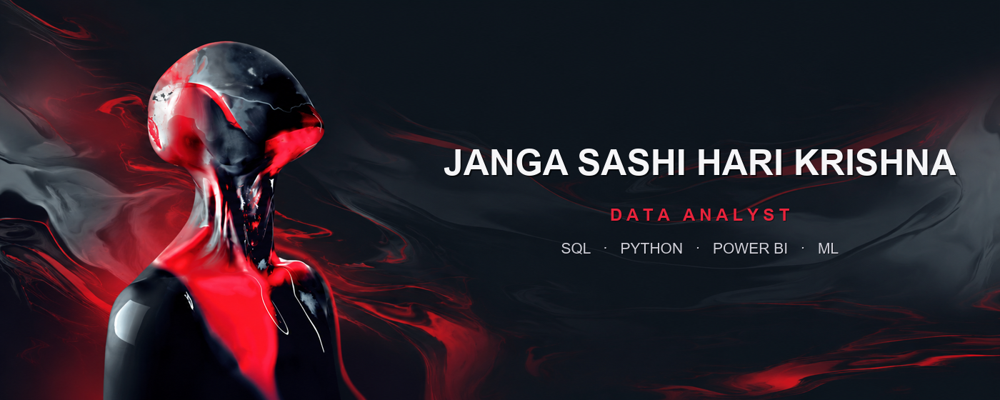
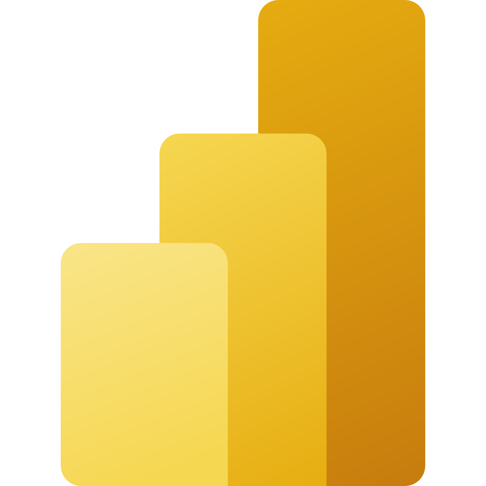
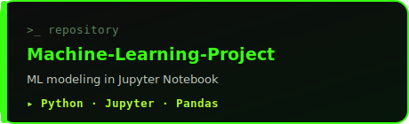
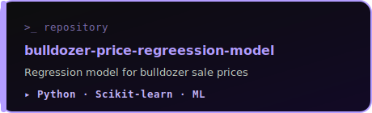
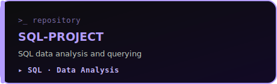
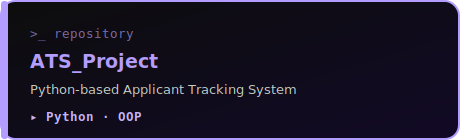
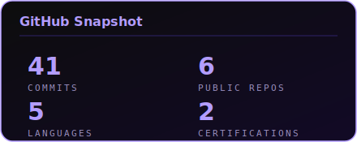
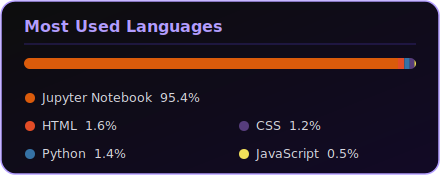

<!-- ============================================================================
     JANGA SASHI HARI KRISHNA — DATA ANALYST
     Neon-green "data terminal" profile · premium build
     Palette: #B39DFF neon · #6D28D9 deep green · #0D0D0D void · #C4B5FD lime
     ============================================================================ -->

<!-- ============================= HERO BANNER ============================= -->
<div align="center">



</div>

<br/>
<br/>

<!-- ============================= IDENTITY ============================= -->
<div align="center">


<br/><br/>

[](https://git.io/typing-svg)

<br/>


&nbsp;

&nbsp;

&nbsp;


<br/><br/>

<!-- ============================= SOCIAL ROW (recruiter-friendly) ============================= -->
<a href="https://www.linkedin.com/in/sashi-hari-krishna-janga-96aa28223/">
  
</a>
&nbsp;
<a href="mailto:shashikrish.143@gmail.com">
  
</a>
&nbsp;
<a href="https://instagram.com/paradox____._">
  
</a>
&nbsp;
<a href="https://github.com/jangasashi">
  
</a>

</div>

<br/>

---

<!-- ============================= SHOWCASE / IN MOTION ============================= -->
<div align="center">

## `> IN THE FLOW`


<sub>`// deep work — where raw data becomes decisions`</sub>

</div>

<br/>

---

<!-- ============================= SYSTEM PROFILE ============================= -->
<div align="center">

## `> SYSTEM PROFILE`

</div>

```python
# =============================================
#  SYSTEM INIT — DATA ANALYST NODE
# =============================================

class DataAnalyst:
    name      = "Janga Sashi Hari Krishna"
    role      = "Data Analyst"
    location  = "Bangalore, India"
    email     = "shashikrish.143@gmail.com"

    analytics_tools  = ["SQL", "Python", "Power BI", "Excel"]

    analysis_skills  = ["Data Collection", "Data Preparation",
                        "Exploratory Data Analysis", "KPI Reporting",
                        "Dashboard Development", "Performance Reporting"]

    visualization    = ["Power BI Dashboards", "Excel Charts", "Data Storytelling"]

    professional     = ["Stakeholder Collaboration", "Communication",
                        "Problem Solving", "Documentation",
                        "Attention to Detail"]

    status = "ONLINE ✔"

    def execute(self):
        return "Turning raw data into decisions. 📊"

# =============================================
```

<br/>

<!-- ============================= ABOUT ME ============================= -->
## `> ABOUT ME`

```bash
$ whoami
> data analyst who turns raw, messy data into decisions people actually trust
```

- 🟢 &nbsp;**Data Analyst** in **Bengaluru, India** — I live in the full pipeline: **SQL → cleaning → EDA → KPI reporting → Power BI dashboards**.
- 🤖 &nbsp;**Machine Learning Intern @ UnifiedMentor** — shipped classification *(KNN, Decision Tree, Random Forest)* and regression *(Linear, Ridge, Lasso)* models end-to-end, deployed with `joblib` pipelines.
- 📊 &nbsp;I design **star-schema data models**, write **DAX** for real KPIs, and ship dashboards with **Row-Level Security** + scheduled refresh.
- 🎓 &nbsp;**B.Tech** — Rajeev Gandhi Memorial College of Engineering & Technology *(2024)*.
- 🧠 &nbsp;Fluent across **SQL · Power BI · Excel · Python** *(Pandas, NumPy, Scikit-learn, Seaborn, Matplotlib)*.
- 💬 &nbsp;Ask me about **SQL, Power BI / DAX, dashboard design, EDA, or turning a vague question into a measurable metric**.
- 📫 &nbsp;**shashikrish.143@gmail.com**

<br/>

---

<!-- ============================= EXPERIENCE ============================= -->
## `> EXPERIENCE`

**🤖 Machine Learning Intern — UnifiedMentor**


- Built **classification** (KNN, Decision Tree, Random Forest) and **regression** (Linear, Ridge, Lasso) models
- Full **data preprocessing** — missing values, outliers, encoding, scaling
- **EDA & visual insights** with Seaborn & Matplotlib
- Deployed trained models with **`joblib`** in structured, version-controlled ML pipelines
- 📈 **Result:** reproducible ML solutions that improved prediction accuracy on real datasets

<br/>

---

<!-- ============================= TOOLS ============================= -->
## `> ANALYTICS & DATA TOOLS`

<div align="center">


&nbsp;

&nbsp;


<br/><br/>


&nbsp;

&nbsp;

&nbsp;

&nbsp;

&nbsp;

&nbsp;

&nbsp;


</div>

<br/>

## `> DATA ANALYSIS SKILLS`

<div align="center">


&nbsp;

&nbsp;


<br/><br/>


&nbsp;

&nbsp;


</div>

<br/>

## `> DATA VISUALIZATION`

<div align="center">


&nbsp;

&nbsp;


</div>

<br/>

## `> PROFESSIONAL SKILLS`

<div align="center">


&nbsp;

&nbsp;


<br/><br/>


&nbsp;


</div>

<br/>

---

<!-- ============================= PROJECTS (banner cards) ============================= -->
<div align="center">

## `> FEATURED PROJECTS`

<a href="https://github.com/jangasashi/Machine-Learning-Project">
  
</a>
&nbsp;
<a href="https://github.com/jangasashi/bulldozer-price-regreession-model">
  
</a>

<a href="https://github.com/jangasashi/SQL-PROJECT">
  
</a>
&nbsp;
<a href="https://github.com/jangasashi/ATS_Project">
  
</a>

<br/><br/>

| # | Project | Description | Stack |
|:---:|---------|-------------|-------|
| 01 | [Machine-Learning-Project](https://github.com/jangasashi/Machine-Learning-Project) | ML modeling in Jupyter Notebook | Python · Jupyter · Pandas |
| 02 | [bulldozer-price-regreession-model](https://github.com/jangasashi/bulldozer-price-regreession-model) | Regression model — bulldozer sale prices | Python · Scikit-learn · ML |
| 03 | [SQL-PROJECT](https://github.com/jangasashi/SQL-PROJECT) | SQL-focused data analysis & querying | SQL · Data Analysis |
| 04 | [ATS_Project](https://github.com/jangasashi/ATS_Project) | Python-based Applicant Tracking System | Python · OOP |

</div>

<br/>

---

<!-- ============================= HIGHLIGHTED WORK ============================= -->
## `> HIGHLIGHTED WORK`

**📊 Sales Performance Dashboard** &nbsp;  &nbsp; `Jan 2024`
- Designed a **star schema** (dimension + fact tables) for efficient reporting
- Built **DAX** measures — total sales, growth rate, top-performing products
- Implemented **Row-Level Security (RLS)** to control visibility by role / region
- Published to **Power BI Service** with scheduled auto-refresh → real-time stakeholder monitoring

<br/>

**🍽️ Restaurant Order Analysis** &nbsp;  &nbsp; `Oct 2024`
- Normalized restaurant data into structured **MySQL** tables (orders, customers, menu)
- Wrote optimized SQL with **JOINs, GROUP BY, HAVING, CASE** for customer segmentation
- Built **Excel dashboards** with charts, slicers & KPIs for business insights
- Recommended targeted **pricing, staffing & inventory** actions from the findings

<br/>

---

<!-- ============================= CERTIFICATIONS ============================= -->
## `> CERTIFICATIONS`

<div align="center">


&nbsp;


</div>

<br/>

---

<!-- ============================= ANALYTICS ============================= -->
## `> GITHUB ANALYTICS`

<div align="center">


&nbsp;&nbsp;


<br/><br/>


</div>

<br/>

---

<!-- ============================= PAC-MAN GAME ============================= -->
## `> PAC-MAN EATING MY CONTRIBUTIONS`

<div align="center">

<picture>
  <source media="(prefers-color-scheme: dark)" srcset="https://raw.githubusercontent.com/jangasashi/jangasashi/output/github-contribution-grid-pacman-dark.gif">
  <source media="(prefers-color-scheme: light)" srcset="https://raw.githubusercontent.com/jangasashi/jangasashi/output/github-contribution-grid-pacman.gif">
  
</picture>

</div>

<br/>

---

<!-- ============================= CONNECT ============================= -->
## `> CONNECT`

<div align="center">

<a href="https://www.linkedin.com/in/sashi-hari-krishna-janga-96aa28223/">
  
</a>
&nbsp;
<a href="mailto:shashikrish.143@gmail.com">
  
</a>
&nbsp;
<a href="https://instagram.com/paradox____._">
  
</a>
&nbsp;
<a href="https://github.com/jangasashi">
  
</a>

</div>

<br/>

---

<div align="center">

`> DATA IS THE NEW OIL. ANALYSIS IS THE REFINERY.`


</div>
